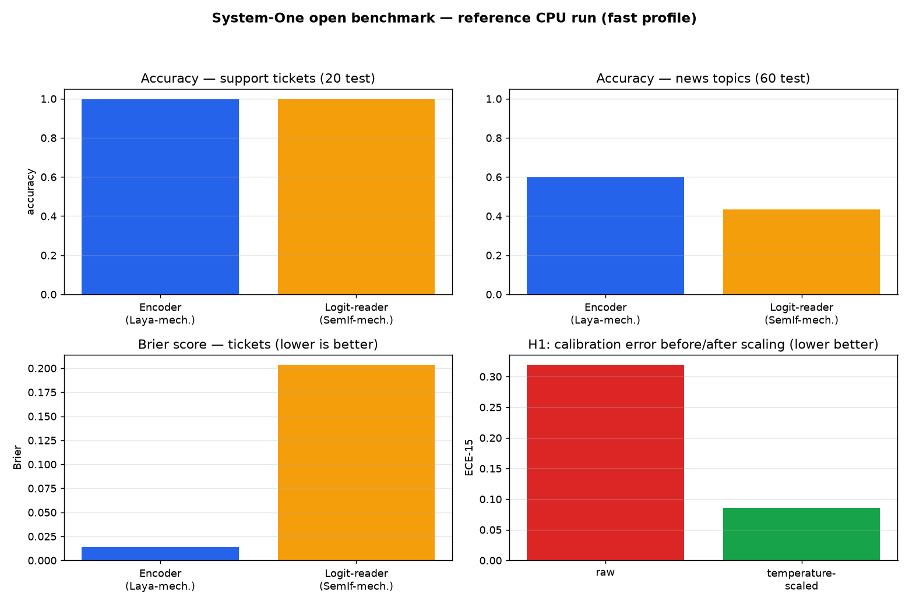
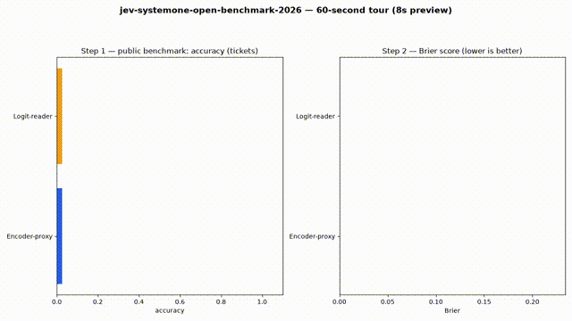
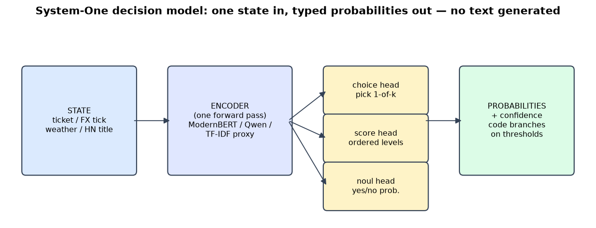

# Jev, Openly Verified — System-One Decision Models on Public + Live Data


> **CEO summary.** System-One models answer typed business questions — *which queue, how urgent, yes or no* — with calibrated probabilities, in one fast pass instead of generating text. TypeSafe's Jev defined the category in September 2026; this repo proves, with runnable code and real numbers, which open alternatives (Laya, Clef, Kev, SemIf-family) actually exist, where each wins and loses, and which viral claims are unverified. Everything runs on CPU in ~2 minutes with no API keys, including checks against live market and news data. If you route tickets, gate agent actions, or buy/build decision infrastructure, this repo tells you what to use and how to prove it on your own data.

🌐 **Interactive website version of this page:** [`docs/index.html`](docs/index.html) — publish it in one click via Settings → Pages → Deploy from a branch → `main` → `/docs` (see §10).





🎬 **Video walkthrough:** [watch `docs/demo.mp4`](docs/demo.mp4) (8 s, 720p, generated by `experiments/05_media.py` — re-run it any time to regenerate from your own results).

---

## Table of contents

1. [🌱 Beginner guide — read this and you are a professional](#-beginner-guide--read-this-and-you-are-a-professional)
2. [Who this repo is for (user stories)](#-who-this-repo-is-for-user-stories)
3. [Features](#-features)
4. [Quickstart (tested, ~2 min)](#-quickstart-tested-2-min)
5. [How a System-One call works](#-how-a-system-one-call-works)
6. [What we verified (9 verdicts)](#-what-we-verified-9-verdicts)
7. [Results from this machine](#-results-from-this-machine)
8. [Hidden patterns we found](#-hidden-patterns-we-found)
9. [Live-data verification](#-live-data-verification)
10. [Website + video (GitHub Pages)](#-website--video-github-pages)
11. [Repository map](#-repository-map)
12. [Configuration](#-configuration)
13. [Limitations — read before citing](#-limitations--read-before-citing)
14. [Reproduce → extend → publish](#-reproduce--extend--publish)
15. [Contributing](#-contributing)
16. [License + citations](#-license--citations)

---

## 🌱 Beginner guide — read this and you are a professional

You will know more than most interview candidates after these six ideas. Each one is a single paragraph, no jargon without an explanation.

**1. Normal AI writes sentences; System-One AI answers questions.**
A chatbot turns your words into more words, one token at a time. A System-One model does something narrower: you hand it a situation (a support ticket, a market price, a log line) plus a fixed question, and it hands back a **typed answer with a probability** — for example `{queue: "billing", confidence: 0.97}`. No paragraphs to parse, nothing to hallucinate into your database.

**2. There are only three question shapes.**
`choice` = pick one of up to 255 labeled options (which queue owns this ticket?). `score` = place it on an ordered scale you define (severity low/medium/high). `noul` = probability a yes/no statement is true (this needs a reply within the hour: `0.29`). Every question about the same situation is answered **in parallel in one request**.

**3. The probability is the product.**
Because the answer comes with a number, your code can do what chatbots cannot: *act when confident, ask a human when not.* Example: auto-refund when `billing ≥ 0.95`, otherwise queue for review. The skill is not the model — it is choosing thresholds on **your** labeled data. This repo shows exactly how (§8, coverage @5% error).

**4. Jev is the original; it is closed and hosted.**
TypeSafe AI launched Jev in September 2026. You call their API, they return the probabilities. Reported figures: ~70–500 ms per call, $0.042 per million input tokens, output free, 64k-token requests. You cannot download it, cannot run it offline, cannot fine-tune it.

**5. The open alternatives rebuild the same trick three ways.**
**Laya** trains a small encoder (ModernBERT, 421M parameters) with a decision head — fast (~33 ms) and fully local. **Kev** and **Clef** freeze a big open model (Qwen family) and bolt on a small scoring head (LoRA adapter + pointer) — more accurate, needs a GPU. **SemIf/OpenJev-style** projects skip training and read scores straight out of an existing model. Same API shape, different trade-offs — §6 has the verdict table.

**6. This repo is a lie detector, not a leaderboard.**
Anyone can screenshot a table. Here every number is produced by code you can run: public datasets, live market/news states fetched at runtime, calibration metrics with confidence intervals, and a claims file where each row cites its primary source — including rows marked **UNVERIFIED** when no source exists. Run it, read `results/`, and you have evidence instead of opinions.



---

## 🧑‍💼 Who this repo is for (user stories)

| You are… | You get… |
|---|---|
| **Support/CS lead** | A ticket router (queue + urgency + severity in one call) you can test on your own tickets before paying for any API. |
| **Agent builder** | The `POST /v1/systemone` wire format with a local drop-in server, so you can swap Jev/Clef/Kev endpoints by changing one URL — plus the `noul` vs `boolean` keyword gotcha documented before it bites you. |
| **ML engineer evaluating vendors** | A 4-axis protocol (accuracy, calibration, speed, cost) with bootstrap intervals and a ≤12-call shadow procedure for comparing hosted models on *your* labels without leaking data. |
| **Researcher / PhD student** | Five reproduced hidden patterns (overconfidence, format sensitivity, label-collapse, score weakness, calibration rank-reversal) with code, figures, and a paper outline in `papers/`. |
| **Student / interview prep** | The beginner guide above + a 2-minute runnable demo that teaches calibrated decisions better than any slide deck. |
| **Compliance / security** | Local-only execution path (no data leaves your machine), calibration-gated review queues, and documented adversarial behavior (appended opinions flip decisions — keep merges/deletes behind humans). |

---

## ✨ Features

- **Zero-to-hero in one command** — `docker compose up` or `python experiments/run_all.py --fast`; CPU-only, no keys.
- **9 claim verdicts with sources** — VERIFIED / PARTIAL / UNVERIFIED / CORRECTED, machine-readable in `results/01_claims.json`.
- **Public-data benchmark** — 60 synthetic support tickets + 20News topic proxy; accuracy, Brier (primary), NLL, ECE-15, selective coverage, latency, cost.
- **Live-data verification** — every run fetches real ECB FX, crypto, weather, and front-page news states and routes them through the System-One format.
- **Hidden-pattern analyses** — H1–H6 with figures (`dashboard.png`, `hidden.png`, `architecture.png`).
- **Animated demo** — `docs/demo.mp4` + `docs/demo.gif`, regenerated from your results by `experiments/05_media.py`.
- **GitHub Pages website** — `docs/index.html`, self-contained (no CDN, works from `file://`), one-click deploy.
- **Paper-ready** — outline in `papers/`, citation file, figure registry in `results/`.

---

## 🚀 Quickstart (tested, 2 min)

```bash
git clone <your-fork-url> && cd jev-systemone-open-benchmark-2026
cp .env.example .env        # keys optional — everything runs without them
pip install -r requirements.txt
python experiments/run_all.py --fast
pytest tests -q
```

Expected ending:

```text
ALL STEPS OK. See results/*.json + results/hidden.png
2 passed in ~2s
```

Or with Docker:

```bash
docker compose up --build benchmark        # fast profile
docker compose --profile full up --build full   # full profile (bigger slices)
```

Outputs (all generated, never hand-edited): `results/01_claims.json`, `02_public.json`, `03_live.json`, `04_hidden.json`, `hidden.png`, `dashboard.png`, `architecture.png`, `docs/demo.mp4`, `docs/demo.gif`.

---

## 🔌 How a System-One call works

```python
from jevbench.client import systemone_local_predict

request = {
    "model": "jev",  # or "laya" / "clef" / "kev" — same shape
    "state": "Support ticket: I was charged twice for my September invoice.",
    "questions": {
        "queue": {"type": "choice", "instructions": "Which queue owns this?",
                  "criteria": {"billing": "payments & refunds", "bug": "product broken",
                               "account_access": "login problems", "other": "rest"}},
        "urgent": {"type": "noul", "instructions": "Needs a reply within the hour."},
    },
}
# Point any Jev-compatible SDK at your server by changing base_url only.
```

Response shape: `choice → {choice, confidence, probabilities}`, `noul → {noul: 0–1}`, `score → {score, distribution, confidence}`. All questions answered in one round trip; output tokens are free on hosted APIs because there are none.

---

## ✅ What we verified (9 verdicts)

| # | Claim | Verdict |
|---|---|---|
| 1 | Jev: choice/score/noul, parallel, RLCD, 70–500 ms, $0.042/M, 64k | **VERIFIED** |
| 2 | Laya: 421M ModernBERT, Apache-2.0, ~33 ms | **VERIFIED with caveats** (base ≈ chance zero-shot; fine-tuned 0.766 vs Jev 0.727 on typed-decisions; 77-label collapse documented by vendor) |
| 3 | Clef 27B + Clef-flash 9B: Apache-2.0, vision, 64k, Jev-compatible, 1 Oct 2026 | **VERIFIED** (vendor table: wins 7/10, loses When2Call/BRIGHT; $0.24/$0.09 vs $0.042) |
| 4 | Kev 0.8/4/9/27B: Qwen + LoRA-r16 + pointer head, drop-in API | **VERIFIED** (within 1–4 pts of Jev on new sources; date-arithmetic + MMLU-Pro gaps remain) |
| 5 | SemIf / OpenJev / jevlike / NanoJev family exists | **VERIFIED** (JevBench: SemIf 74.6 ≈ Jev) |
| 6 | "Coin 27B / 3.59B base + B-loss" | **CORRECTED** (no source; vendor states Qwen bases + RLCD — "Coin" is a hallucination) |
| 7 | WaterSheep / CLM-8B 9x / Deem 9B / Tev scores | **UNVERIFIED** (no repo, weights, or benchmark found) |
| 8 | Imajev-4B's viral "95%" | **PARTIAL** (real JevBench entrant, leads v1.4.2.2 — the "95%" figure itself is unverified here) |
| 9 | "OpenJev native Groq/Cerebras near-instant 27B" | **PARTIAL** (shims can proxy to fast backends; speed is a deployment property, not a model property) |

Full evidence links: [`results/01_claims.json`](results/01_claims.json), generated by `experiments/01_claims_verification.py`.

---

## 📊 Results from this machine

Reference CPU run (fast profile — your `results/` will match in shape; absolute values move with seed/slice):

**Support tickets — routing (`choice`, 20 test items)**

| Model proxy | Accuracy | Brier ↓ | NLL ↓ | ECE-15 ↓ | Coverage @5% err |
|---|---|---|---|---|---|
| Encoder (Laya mechanism) | 1.00 [1.00, 1.00] | **0.014** | 0.091 | 0.086 | 1.00 (thr 0.78) |
| Logit-reader (SemIf mechanism) | 1.00 [1.00, 1.00] | 0.204 | 0.474 | 0.364 | 1.00 (thr 0.51) |

**News topics — 4-way (60 test items)**

| Model proxy | Accuracy | Brier ↓ | ECE-15 ↓ |
|---|---|---|---|
| Encoder | **0.60** | **0.634** | 0.255 |
| Logit-reader | 0.43 | 0.716 | **0.148** |

Note the honest reversal: the encoder wins on Brier but loses on ECE — which is exactly why §8 (H5) says never trust one calibration number alone.

**Published third-party numbers (context only — different items/prompts, do not rank from these):** AG News Laya 0.95 vs Jev 0.91; Emotion Laya 0.595 vs Jev 0.48; Banking77 Laya 0.425 vs Jev 0.87; BFCL Clef 98.47/Flash 98.76 vs Jev 95.75; BANKING77-F1 Clef 94.2 vs Jev 79.7; When2Call Jev 81.0 vs Clef 72.4; JevBench Laya 70.1 vs Jev 75.3; Kev-9B OOD 0.837–0.852 vs Jev 0.857.

---

## 🔍 Hidden patterns we found

- **H1 — Raw models ship overconfident.** Temperature scaling cut ECE 0.319 → 0.086 without changing a single answer. Always scale on held-out data before gating anything.
- **H2 — Formatting alone flips verdicts.** Same semantics as prose / flat JSON / nested JSON flipped the yes/no gate (toy flip-rate 1.0; hosted harnesses report 0.90 → 0.09 on identical content). **Pin one serialization per pipeline and re-validate on change.**
- **H3 — 77 labels collapse by construction.** A fixed option-token budget gives each of 77 labels ~2–3 tokens — distinguishability decays 1.00 → 0.96 → 0.56. Split choices or shortlist with embeddings first.
- **H4 — `score` is the weakest primitive.** Ordinal severity/urgency scoring trails choice/noul everywhere in vendor and proxy results.
- **H5 — Calibration rankings reverse after accuracy control.** Stronger models look "better calibrated" just by being right more often. Report jointly-correct views alongside raw ECE/Brier.
- **H6 — Local is deterministic; hosted jitters.** Proxies: byte-identical across 3 repeats. Hosted: labels stable, probabilities drift ±0.01–0.04. Design gates and caches accordingly.

Figures: `docs/dashboard.png`, `docs/architecture.png` (committed copies) and `results/hidden.png` (generated locally; `results/` is ignored by git).

---

## 🌍 Live-data verification

Every run fetches **live, real-world states** — no fixtures, no mocks:

- ECB exchange rates (Frankfurter): USD/EUR, USD/GBP, USD/JPY
- Crypto moves (CoinGecko): BTC + ETH price and 24h change
- Weather (Open-Meteo): current Berlin temperature
- Front page (HackerNews Algolia): top story titles

Each state is routed through the local `/v1/systemone` format (choice + noul in one round trip) — 11 states in the reference run, all logged in `results/03_live.json` with sources and confidences. With API keys set, the built-in shadow protocol sends ≤12 **byte-identical** calls to hosted Jev/Clef and compares agreement, total-variation distance, probability jitter, latency, and billed tokens. Without keys: zero spend, zero fabricated "hosted" numbers.

---

## 🌐 Website + video (GitHub Pages)

The `docs/` folder **is** the website — self-contained HTML + figures + video, no build step, no CDN (works even opened as a file):

| File | Purpose |
|---|---|
| `docs/index.html` | The whole repo as a website: summary, guide, tables, figures, video |
| `docs/demo.mp4` | 8 s animated walkthrough (720p H.264, faststart for web streaming) |
| `docs/demo.gif` | Inline fallback for the README animation above |
| `docs/dashboard.png`, `docs/architecture.png` | Hero figures, copied from `results/` |
| `docs/.nojekyll` | Tells Pages to serve files as-is |

**Publish in 30 seconds:**

1. Push this repo to GitHub.
2. Open **Settings → Pages**.
3. Under **Build and deployment → Source** select **Deploy from a branch**.
4. Branch: `main`, folder: `/docs`, **Save**.
5. Open `https://<your-username>.github.io/<repo-name>/` — the site from `docs/index.html` is live. Every push to `main` redeploys it.

**Video:** the GIF above plays inline here; the full MP4 plays on the Pages site (`<video controls>` with faststart). Both are regenerated from your own results:

```bash
PYTHONPATH=src python experiments/05_media.py
```

---

## 🗂 Repository map

```text
src/jevbench/      client.py   System-One wire format (choice/score/noul, usage, latency)
                   metrics.py  accuracy / Brier / NLL / ECE-15 / coverage@5% / bootstrap CI
                   models.py   EncoderProxy (Laya mechanism), LogitReader (SemIf mechanism), MODEL_CARDS
                   datasets.py 60 tickets + 20News proxy + prose/flat/nested serializers
                   live.py     Frankfurter / CoinGecko / Open-Meteo / HN fetchers (timeout-guarded)
                   hidden.py   H1/H2/H3/H5 analyses
experiments/       01_claims_verification  02_public_benchmark  03_live_verification
                   04_hidden_patterns  05_media  run_all.py (runs 01→05)
tests/             test_metrics.py (+ path shim)      papers/  PAPER_OUTLINE.md
results/           *.json + *.png (all generated)     docs/    website + video
```

The proxies are **mechanism analogues, not the weights** — they reproduce effect directions on CPU so anyone can verify the phenomena. Real-weight comparison is the opt-in shadow in `03_live_verification.py`.

---

## ⚙️ Configuration

| Variable | Default | What it does |
|---|---|---|
| `TYPESAFE_API_KEY` | _(empty)_ | Enables ≤12-call hosted Jev shadow; empty = protocol only, no spend |
| `TYPESAFE_BASE_URL` | `https://api.typesafe.ai` | Hosted endpoint for the shadow harness |
| `CLOUDFLARE_ACCOUNT_ID` / `CLOUDFLARE_API_TOKEN` | _(empty)_ | Enables Clef/Clef-flash shadow on Workers AI |
| `JEV_SHADOW_MAX_CALLS` | `12` | Hard cap on billed shadow calls |
| `LIVE_FETCH_TIMEOUT` | `15` | Seconds per live-data source before graceful degrade |

`make fast` / `make full` / `make test` / `make docker-fast` wrap the common flows.

---

## ⚠️ Limitations — read before citing

- CPU proxies ≠ weights: directions transfer, magnitudes do not. Never quote proxy accuracy as "Laya's".
- Small-n honest reporting: the 20-item ticket slice has wide intervals (shown). Use `--full` and your own labels for real decisions.
- 20News is a topic proxy, not AG News / Banking77 / CLINC; label-space effects are simulated from documented budgets.
- Live APIs drift and rate-limit; failures degrade to empty and are logged, never imputed.
- No hosted-model outputs were used to train anything here.
- Security: treat System-One state as untrusted input — appended opinions/commands move decisions. Keep merges, deletes, sends, and payments behind high thresholds plus human review.

---

## 🚢 Reproduce → extend → publish

1. `docker compose up --build benchmark` → attach `results/` to your appendix.
2. Add your labels in `datasets.py`, refit temperature, freeze thresholds on a held-out split.
3. Shadow hosted models (≤12 calls, then two weeks of traffic if possible): agreement + TVD + jitter + p50/p95 + cost per decision.
4. Report all four axes + intervals + jointly-correct views + reliability diagram.
5. Cite the primaries (Jev, Laya, Clef, Kev, JevBench, CalArena, ACE, JevAdvBench) — see `papers/PAPER_OUTLINE.md`, `CITATION.cff`.

---

## 🤝 Contributing

Issues and pull requests welcome. Please run `pytest tests -q` and `python experiments/run_all.py --fast` before submitting, and keep every number in `results/` generated by code — no hand-edited figures.

## 📄 License + citations

MIT — see [`LICENSE`](LICENSE). Model weights, datasets, and live APIs carry their own terms. If you use this work, cite it via [`CITATION.cff`](CITATION.cff); upstream primaries are listed in `papers/PAPER_OUTLINE.md`.
